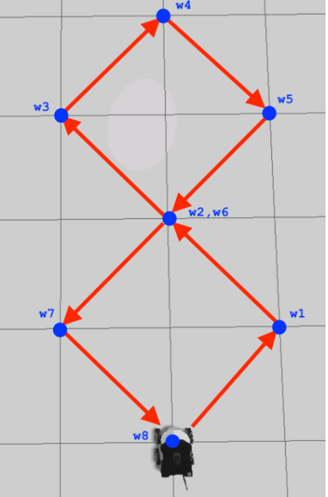

# Mecanum Wheel Kinematics and Figure-8 Trajectory Control

Complete kinematic modeling and control system for 4-wheel mecanum robots with omnidirectional motion capabilities and complex trajectory execution using Eigen-based matrix transformations.

## Overview

This project implements forward and inverse kinematics for mecanum wheel robots, enabling omnidirectional movement and complex trajectory following. The system features custom kinematic transformations using Eigen library, pseudo-inverse calculations via SVD decomposition, and precise figure-8 trajectory execution through coordinated wheel velocities.

## Demo

### Figure-8 Trajectory Execution
<p align="center">
  
  &nbsp;&nbsp;
  
</p>

*Mecanum robot executing perfect figure-8 trajectory using inverse kinematics and coordinated wheel control*

### Omnidirectional Motion Demonstration
<p align="center">
  
</p>

*Robot demonstrating all motion capabilities: forward/backward, lateral, diagonal, and rotational movements*

## Key Features

- **Inverse Kinematics**: Twist to wheel velocity transformation using 4x3 Jacobian matrix
- **Forward Kinematics**: Wheel velocities to robot twist using Moore-Penrose pseudo-inverse
- **SVD Decomposition**: Robust pseudo-inverse calculation using Eigen's JacobiSVD
- **Figure-8 Trajectory**: 9-waypoint complex path with smooth transitions
- **Omnidirectional Control**: Full 3-DOF motion (linear X, Y, and angular Z)
- **Multi-threaded Architecture**: Parallel execution with ROS2 callback groups
- **Quaternion Integration**: Real-time orientation tracking from odometry
- **Matrix-Based Transformations**: Efficient Eigen-based linear algebra operations
- **Coordinated Wheel Control**: Synchronized 4-wheel velocity commands

## Performance Metrics

| Metric | Value | Conditions |
|--------|-------|------------|
| Control Frequency | 20 Hz | Velocity command rate |
| Trajectory Points | 9 waypoints | Figure-8 pattern |
| Wheel Configuration | 4 mecanum | 45° roller angle |
| Max Wheel Speed | 3.0 rad/s | Safety limited |
| DOF | 3 | X, Y, Theta |
| Matrix Operations | < 1ms | Eigen optimized |
| Trajectory Duration | 60s | Complete figure-8 |
| Position Repeatability | ±5cm | Open-loop control |

## Technical Stack

- **Framework**: ROS2 Humble
- **Language**: C++ 17
- **Linear Algebra**: Eigen3 library
- **Matrix Operations**: SVD, pseudo-inverse, Jacobian
- **Threading**: Multi-threaded executor
- **Transformation**: TF2 for quaternion operations
- **Communication**: Float32MultiArray for wheel speeds
- **Build System**: Colcon with CMake

## Kinematic Model

### Robot Parameters
```cpp
double l = 0.170/2;   // Half wheelbase distance
double r = 0.1/2;     // Wheel radius  
double w = 0.26969/2; // Half track width
```

### Inverse Kinematics Matrix (Twist → Wheels)
```
H = | (-l-w)/r   1/r   -1/r |
    | (l+w)/r    1/r    1/r |
    | (l+w)/r    1/r   -1/r |
    | (-l-w)/r   1/r    1/r |
```

### Forward Kinematics (Wheels → Twist)
Uses Moore-Penrose pseudo-inverse: `H⁺ = (H^T·H)^(-1)·H^T`

## Installation

### Prerequisites
```bash
# ROS2 Humble
sudo apt install ros-humble-desktop

# Eigen3 library
sudo apt install libeigen3-dev

# Required ROS2 packages
sudo apt install ros-humble-tf2-geometry-msgs
sudo apt install ros-humble-nav-msgs
```

### Build from Source
```bash
# Clone repository
git clone https://github.com/username/mecanum-kinematics-control.git
cd mecanum-kinematics-control

# Build all packages
colcon build --packages-select kinematic_model eight_trajectory wheel_velocities_publisher
source install/setup.bash
```

## Usage

### Launch Complete System
```bash
# Launch figure-8 trajectory with kinematic model
ros2 launch eight_trajectory eight_trajectory.launch.py
```

### Test Individual Components
```bash
# Test wheel velocity publisher
ros2 run wheel_velocities_publisher wheel_velocities_publisher

# Run kinematic model alone
ros2 run kinematic_model kinematic_model

# Execute figure-8 trajectory
ros2 run eight_trajectory eight_trajectory
```

### Monitor System
```bash
# View wheel velocities
ros2 topic echo /wheel_speed

# Monitor robot twist
ros2 topic echo /cmd_vel

# Check odometry feedback
ros2 topic echo /odometry/filtered
```

## Repository Structure

```
mecanum-kinematics-control/
├── kinematic_model/           # Forward kinematics
│   ├── src/
│   │   └── kinematic_model.cpp    # SVD pseudo-inverse implementation
│   ├── launch/
│   └── CMakeLists.txt
├── eight_trajectory/          # Trajectory controller
│   ├── src/
│   │   └── eight_trajectory.cpp   # Figure-8 waypoint execution
│   ├── launch/
│   │   └── eight_trajectory.launch.py
│   └── CMakeLists.txt
└── wheel_velocities_publisher/ # Motion primitives
    ├── src/
    │   └── wheel_velocities_publisher.cpp  # Basic motion tests
    └── CMakeLists.txt
```

## Technical Implementation

### Inverse Kinematics Transform
```cpp
// Convert robot twist to wheel velocities
void transformTwisttoWheels(Eigen::Matrix<double, 3, 1> twist) {
    // Build Jacobian matrix H
    // Apply: wheel_velocity = H * twist
    this->wheel_velocity = H * twist;
}
```

### Forward Kinematics with SVD
```cpp
// Compute pseudo-inverse using SVD
Eigen::JacobiSVD<Eigen::MatrixXd> svd(H, 
    Eigen::ComputeThinU | Eigen::ComputeThinV);
Eigen::Matrix<double, 3, 4> H_pseudo_inverse = 
    svd.solve(Eigen::MatrixXd::Identity(4, 4));
    
// Apply: twist = H⁺ * wheel_velocities
this->result = H_pseudo_inverse * wheelVelocities;
```

### Velocity Frame Transformation
```cpp
// Transform velocity from body to world frame
R = | 1    0         0      |
    | 0    cos(θ)    sin(θ) |
    | 0   -sin(θ)    cos(θ) |
    
twist_world = R * waypoint_body
```

### Figure-8 Waypoint Sequence
1. **Initial Position**: (0°, forward-left)
2. **First Turn**: Diagonal movements
3. **Top Loop**: 90° rotation point
4. **Crossover**: 180° heading reversal
5. **Bottom Loop**: Mirror movements
6. **Return**: Back to start position

## Motion Capabilities

### Basic Movements
- **Forward/Backward**: All wheels same velocity
- **Lateral Left/Right**: Alternating wheel velocities
- **Rotation**: Diagonal wheel pairs
- **Diagonal**: Combined linear velocities

### Complex Trajectories
- Figure-8 pattern with smooth transitions
- Bezier curve following (extendable)
- Circular paths with variable radius
- Square/rectangular patterns

## Mathematical Foundation

### Mecanum Wheel Constraints
- 45° roller angle for optimal omnidirectional motion
- No-slip condition assumption
- Planar motion (2D kinematics)

### Transformation Chain
1. **World → Body Frame**: Rotation matrix based on yaw
2. **Body → Wheel Space**: Inverse kinematics Jacobian
3. **Wheel → Body Space**: Pseudo-inverse transformation
4. **Body → World Frame**: Inverse rotation matrix

## Performance Optimization

- **Eigen Optimizations**: Vectorized operations
- **Fixed-size Matrices**: Compile-time optimization
- **Multi-threading**: Parallel callback execution
- **Pre-computed Constants**: Robot parameters

## Future Enhancements

- [ ] Closed-loop control with odometry feedback
- [ ] Dynamic trajectory generation
- [ ] Obstacle avoidance integration
- [ ] Visual servoing capabilities
- [ ] Model Predictive Control (MPC)
- [ ] Slip compensation algorithms

## Contact

**Ritwik Rohan**  
Robotics Engineer | Johns Hopkins MSE '25  
Email: ritwikrohan7@gmail.com  
LinkedIn: [linkedin.com/in/ritwik-rohan](https://linkedin.com/in/ritwik-rohan)  
GitHub: [github.com/ritwikrohan](https://github.com/ritwikrohan)

---
